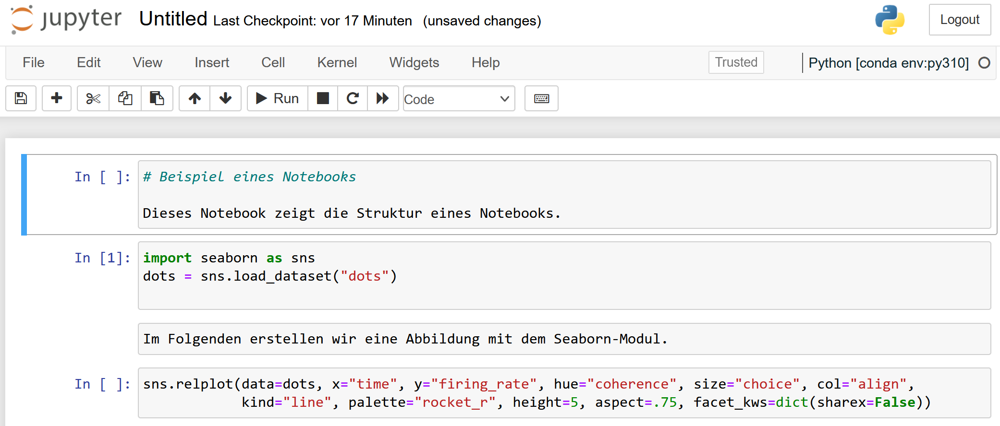

<!--
SPDX-FileCopyrightText: 2023 Johannes Keyser, Amalaswintha Leh

SPDX-License-Identifier: CC-BY-4.0
-->
---
title: "Eine Einführung in statistische Programmierung mit Python"
subtitle: "HeFDI Data Week"
author: "Johannes Keyser und Amalaswintha Leh"
date: 15 Juni 2023
urlcolor: violet
---

# Struktur und Ziele des Vortrags

- Worum geht es in diesem Vortrag?
   - Übersicht & Einblicke angewandter Statistik in Python
      - Wir verstehen "statistische Programmierung" im weiteren Sinne, inklusive Datenaufbereitung und -exploration
   - Schnelleinstieg in verschiedene statistische Anwendungen
   - Hinweise zur Frage "Ist Python auch für mich?"
- Wenig Wissen/Annahmen über heutiges Publikum
   - Annahme: Interesse an Python für Forschungsdatenverarbeitung
   - "Spagat" zwischen unseren und allgemein nützlichen Workflows
   - Entwarnung: Beispiele bauen nicht/kaum aufeinander auf
- Worum wird es nicht gehen?
   - Keine tiefe Erklärung zu Python, Programmierung, Statistik
   - Kein Workshop/Tutorial; Interaktion nur per Fragen möglich
     <!--- NOTE: Würde auch den Zeitrahmen sprengen... -->

---

# Struktur und Ziele des Vortrags

## Themenübersicht

1. Wer sind wir?
2. Einführung ins (wissenschaftliche) Python-Ökosystem
3. Anwendungsbeispiele (auch aus unserer Forschung)
   - Deskriptive Statistik und Visualisierung
   - Inferenzstatistik mit R-Funktionen
   - Signalverarbeitung
   - Spezifische statistische Modellierung
4. Ausblick

## Format

- Die Beispiele sind als Jupyter Notebooks verfügbar
- Zu jedem Abschnitt sind Fragen willkommen

---

# Allgemeine Einführung

Hintergründe unserer Verwendung von & Meinungen zu Python.

## Wer sind wir?

- [AG Experimentelle Sensomotorik](https://www.uni-giessen.de/de/fbz/fb06/sport/arbe/expsen/), Institut für Sportwissenschaft, Justus-Liebig-Universität Gießen
- Forschung zu menschlicher Sinneswahrnehmung und Bewegung
- Experimente mit menschlichen Probanden ($N \approx 20-40$)
   - Meist 1-2 Stunden pro Proband für hunderte Trials
   - Meist tausende Datenpunkte pro Trial
      - Bewegungsdaten (z.B. 3D-Position von Gelenken)
      - Physiologische Daten (z.B. Muskel- und Hirnaktivität)
- Analysemethoden ähnlich wie in Psychologie oder Medizin
   - Deskriptive Statistik, Visualisierung, Exploration
   - Inferenzstatistik (z.B. ANOVA, Regression, Power, ...)
   - Spezifische Modellierung (z.B. Bayessche Modelle, ...)

---

# Allgemeine Einführung

## Was ist Python?

- Hochsprache für Anwendungen (nicht maschinennah); unterstützt unterschiedliche Programmierstile
  <!-- Mögliche Stile sind prozedural, objektorientiert, und funktional. -->
- Entwickelt seit späten 1980ern von Guido van Rossum im _Centrum Wiskunde & Informatica_ in den Niederlanden
   <!-- (abbr. CWI; English: "National Research Institute for Mathematics and Computer Science") -->
- Name "Python" nach TV-Show _Monty Python's Flying Circus_
- Seit 2001 rechtliche Verwaltung durch die gemeinnützige [Python Software Foundation](https://www.python.org/psf/)
- Quelloffen und frei lizensiert unter der [PSF License](https://docs.python.org/3/license.html)
- Offene Weiterentwicklung des Referenz-Interpreters CPython [durch die Community](https://devguide.python.org/)

---

# Allgemeine Einführung

## Was mögen wir an Python?

Als Wissenschaftler mögen wir an Python:

- Relativ einfache Syntax
- Vielseitig einsetzbar, "glue language"
  - Von simpler Konvertierung von `*.xlsx` nach `*.csv`
  - bis zu komplexer statistischer Modellierung.
- Große, offene, aktive, nette Community
- Viele mächtige Module für spezielle Anwendungen
- Inspizierbarkeit dank Quelloffenheit und freier Lizensierung
- Ähnlich wie Wissenschaft selbst ist das "Python-Ökosystem" eher wie ein offener "Bazar", im Gegensatz zu verschlossenen "Kathedralen" einzelner kommerzieller Anbieter

---

## Beliebtheit

Die Popularität von Python ist über die letzten Jahre gestiegen^[Diagramm von [PYPL](https://pypl.github.io/PYPL.html), lizensiert unter [Creative Commons Attribution 3.0 Unported License](https://creativecommons.org/licenses/by/3.0/)]

---

## Beliebtheit

Die Popularität von Python ist größer als ähnliche Programmiersprachen^[Diagramm von [PYPL](https://pypl.github.io/PYPL.html), lizensiert unter [Creative Commons Attribution 3.0 Unported License](https://creativecommons.org/licenses/by/3.0/)]

---

## Anwendungsbereiche

- Python ist im Kern "nur" eine Programmierprache; für fast alle Anwendungen gibt es Module, die von anderen, unabhängigen Communities entwickelt werden
- Vielseitige Anwendung durch Module
  <!-- Manchmal stammen Module auch aus Unternehmensentwicklungen (z.B. bekannte Machine Learning Module wie Tensorflow aus Google, PyTorch aus Facebook/Meta) -->
   - Module folgen keiner allgemeinen Struktur, nur Konventionen
   - Module sind meistens in mehreren Versionen vorhanden
   - Kompatibilität zwischen Modulen und Betriebssystem
      - Empfehlung für relativ schmerzfreies Management: [Anaconda](https://www.anaconda.com/download)
   - "Pflegezustand" berücksichtigen!
      - Wie lange existiert ein Modul schon?
      - Wie viele Personen entwickeln es?
      - Wann wurde es das letzte Mal überarbeitet/Bugs entfernt?
- Wir nennen verwendete Module in den jeweiligen Beispielen.

---

# Wie arbeitet man mit Python?

- Terminal
- IDEs (integrated development environments) haben verschiedene Elemente bzw. Werkzeuge, die das Arbeiten mit Python erleichtern
  - Spyder
  - VS Code
  - PyCharm
  - ...
- Jupyter Notebooks

---

# Wie arbeitet man mit Python?

## Terminal

---

# Wie arbeitet man mit Python?

## IDEs

---

# Wie arbeitet man mit Python?

## IDEs

---

# Wie arbeitet man mit Python?

## IDEs

---

# Wie arbeitet man mit Python?

## Beispiel Spyder

{width=100%}

---

# Wie arbeitet man mit Python?

## Beispiel Spyder

{width=100%}

---

# Wie arbeitet man mit Python?

## Beispiel Spyder

{width=100%}

---

# Wie arbeitet man mit Python?

## Beispiel Jupyter Notebook

- Besonders geeignet für Anfänger und für Kollaborationen
- Schrittweises Ausführen oder Ändern einzelner Code-Abschnitte

\vspace{1em}

---

# Wie arbeitet man mit Python?

## Beispiel Jupyter Notebook

Einfaches Nachvollziehen und Teilen von Code mit Beschreibungen (Markdown) und Ergebnissen (z.B. Diagrammen) in derselben Datei

\vspace{1em}

{width=69%}

---

# Anwendungsbeispiele

- Die folgenden Beispiele aus unserer Forschung sind für allgemeine Nützlichkeit/Transferierbarkeit ausgewählt
   - Bitte den Transfer ins eigene Fachgebiet mitdenken
   - Die Beispiele bauen nicht/kaum aufeinander auf

## Beispielliste

1. Deskriptive Statistik mit Pandas & Seaborn
   - Siehe `notebook_deskriptiveStatistik.ipynb`
2. Inferenzstatistik mit rpy2
   - Siehe `notebook_rpy2.ipynb`
3. Signalverarbeitung mit Scipy
   - Siehe `notebook_signalverarbeitung.ipynb`
4. Parameterschätzung spezieller Modelle
   - Siehe `notebook_modelfitting.ipynb`

---

# Coding with Python

- Hinter oft einfach zu bedienenden Modulen steckt viel Code, der teilweise sehr komplex ist
- Vorteile: Meist gut getestet und ausgereift, mit Dokumentation, Versionierung, bekannten Issues, Warnungen im Code vor Bedienfehlern, usw.
- Nachteile: Komplexität kann undurchsichtig sein, oder zu Fehlern führen, die schwer zu finden sind
- Beispiel anhand Quellcode von [`numpy.mean()`](https://numpy.org/doc/stable/reference/generated/numpy.mean.html):
  Aufruf von
  [numpy/core/fromnumeric.py#L3385-L3505](https://github.com/numpy/numpy/blob/maintenance/1.25.x/numpy/core/fromnumeric.py#L3385-L3505),
  was wiederum
  [numpy/core/_methods.py#L101-L133](https://github.com/numpy/numpy/blob/maintenance/1.25.x/numpy/core/_methods.py#L101-L133) aufruft.

---

# Coding with Python

---

# Coding with Python

- Was tun, wenn die Nutzung eines Moduls für ein bestimmtes Anwendungsproblem nicht mehr ausreicht? 
- Benutzerdefinierte Funktionen/Skripte
- Höheres Anforderungsniveau

---

# Ausblick

## Weitere Module (teilweise fachspezifisch)

- [PyMC](https://www.pymc.io/) für Probabilistisches Programmieren für (nahezu) beliebige Bayessche Modellierung
- [MNE](https://mne.tools/stable/index.html) für Exploration, Visualisierung, und Analyse von neurophysiologischen Daten: MEG, EEG, ECoG, NIRS, ...
- [Astropy](https://www.astropy.org/), [SunPy](https://sunpy.org/): Astronomie, Analyse von Sonnendaten
- Weitere Listen
   - Modulübersicht aus Kategorie "Numeric and Scientific" aus Python-Wiki (von 2017) unter 
<https://wiki.python.org/moin/NumericAndScientific>
   - Von NUMFOCUS gesponsorte Projekte, <https://numfocus.org/sponsored-projects>
     <!-- Case-Studies erwähnen zeigen? <https://numfocus.org/case-studies -->

---

## Unterschiede zu anderen Programmiersprachen

- Im Vergleich zu Matlab, R, Julia, ... ist Python allgemeiner
  - Nicht (nur) für "numerische" / statistische Anwendungen
  - Einfach nutzbar für Experimente, Webseiten, Spiele, ...
- Python ist gut mit anderen Programmen/Sprachen kombinierbar
  - Siehe z.B. das Notebook zu `rpy2` für R-Code in Python
- Python bietet kostenlose Alternativen zu z.B. kostenpflichtige Matlab-Toolboxen <!--- auch Alternative zu z.B. SPSS -->
- Um Python herrscht eine (anfänger-)freundliche "Philosophie"
  - "Pythonic" code: "Beautiful is better than ugly."
  - "Batterien inklusive": Anspruch, direkt loslegen zu können
  - "Es sollte möglichst nur einen offensichtlichen Weg geben, etwas zu tun."

---

## Für wen lohnt es sich, Python zu lernen?

- Keine allgemeine Antwort möglich.
   - Für viele statistische Probleme gibt es auch außerhalb von Python sehr gute Lösungen,
     z.B. [JASP](https://jasp-stats.org/) als bedienfreundliche, grafische Oberfläche für `R`.
  - Problemkomplexität und Zeitaufwand berücksichtigen 
- Zitat zur Frage "Wie lernt man Python am besten?" von Guido van Rossum aus [Lex Fridman Podcast #341](https://lexfridman.com/guido-van-rossum-2/), [YT clip](https://www.youtube.com/watch?v=F2Mx-u7auUs):
  <!-- - Lex: "Do you have advice for a programming beginner on how to learn Python the right way?" -->
  - <!-- Guido: --> "Find something you actually want to do with it.
    If you say 'I want to learn skill X', that's not enough motivation.
    You need to pick something---and it can be completely unrealistic---but something that challenges you into actually learning coding in some language."

---

# Danke! Fragen?

- Danke für die Aufmerksamkeit!
- Welche Fragen gibt es?
